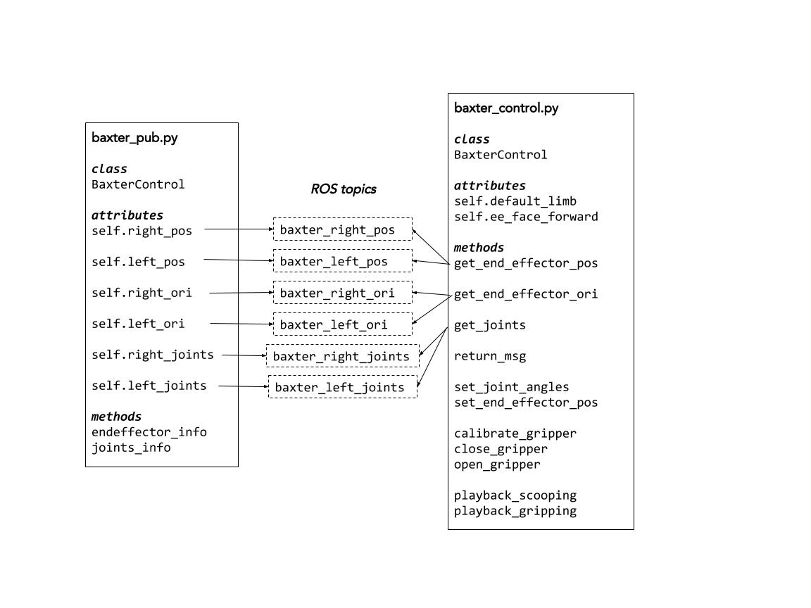

Baxter Control
==============

Baxter’s Python Interface is used to control the robot. Research SDK Example Programs of how it is used are in the Desktop of the lab computers and are also in the Baxter Research Robot website.

For ease of access, a BaxterControl class was created in ``baxter_control.py``.
BaxterControl has the following attributes:

``self.default_arm``
Some of the methods have the option of inputting a limb of choice. If no limb is inputted as a parameter in the methods, the default arm (“right”) will be the used.

``self.ee_face_forward``
This is a list of values, which define the end effector orientation such that the end effector is in the correct scooping orientation.

- BaxterControl has methods can be divided into the following categories:
- Receives Baxter Robot Information
- Controls Limbs
- Controls grippers
- Playback Recorded Trajectory

Receives Baxter Information
^^^^^^^^^^^^^^^^^^^^^^^^^^^

Figure below shows a summary of the methods in BaxterControl and how it gets information from  baxter_pub.py. In baxter_pub.py, key informations of Baxter are formatted and published into different topics as messages. The formatted information are then accessed through subscribing to the different topics in the methods of baxter_control.py.

``baxter_pub.py`` must be running in a different terminal for BaxterControl to receive information about the robot. Run: python baxter_pub.py

Figure 15: Summary of the methods in BaxterControl

The class, BaxterControl ,contains the following methods:

``get_end_effector_pos(limb=None)``
Gets the 3 values that define Baxter’s end effector position.

``get_end_effector_ori(limb=None)``
Gets the 4 values that define Baxter’s end effector orientation.

``get_joints(limb=None)``
Gets the 7 joint angles (in radians) of Baxter’s defined limb.

``return_msg()``
Callback function of the subscriber methods to return the messages given.

Control Limbs
^^^^^^^^^^^^^

``set_joint_angles(joints, limb=None)``
joints = [...] ← list of 7 joint angles
Sets Baxter’s limb to the given joint angles.

``set_end_effector_pos(x, y, z, qx=None, qy=None, dz=None, qw=None, limb=None)``
Sets the robot limb’s end effector to a given absolute position ( x,y,z ) and orientation ( qx,qy,qz, qw ) . If the orientation is not set, the orientations defined as self.ee_face_forward  will be used.

Setting the end effector position requires an inverse kinematics solver, which calculates solutions of possible joint angles for the robot to reach the desired end effector position. The inverse kinematic solver used is the TRAC_IK solver. To download the TRAC-IK library in the directory as shown in section 3.1.3 File Directory, run the following in the terminal:
sudo apt-get install ros-kinetic-trak-ik

And then run the following in the correct directory:

.. code-block:: python

    git clone https://bitbucket.org/traclabs/trac_ik.git

Control Grippers
^^^^^^^^^^^^^^^^

``calibrate_gripper(limb=None)``
Calibrates the gripper. Calibration of the gripper must be done before any movement of the gripper.

``close_gripper(limb=None)``
Closes the gripper.

``open_gripper(limb=None)``
Opens the gripper.

Playback Recorded Trajectory
^^^^^^^^^^^^^^^^^^^^^^^^^^^^

To playback the trajectory, the server must be initiated.
This is done by running the following in a separate terminal:
rosrun baxter_interface joint_trajectory_action_server.py --mode velocity

``playback_scooping()``
Playbacks the recorded joint angles of the robot scooping candy.
The angles are recorded in a file called scooping.rec .

``playback_gripping()``
Playbacks the recorded joint angles of the robot gripping onto candy.
The angles are recorded in a file called gripping.rec .

The playbacks were recorded using the provided example program (  ``joint_position_recorder.py`` ) and the methods were adapted from the example playback program ( joint_trajectory_file_playback.py ).

Motion Planning
^^^^^^^^^^^^^^^
For more information on the motion planning done, please take a look at our `reports (section 3.7.2).
<https://docs.google.com/document/d/1gYLpNBUq5_0UUhcM4bcgzlkC_TXOMYgSC03uhh11frI/edit?usp=sharing>`_