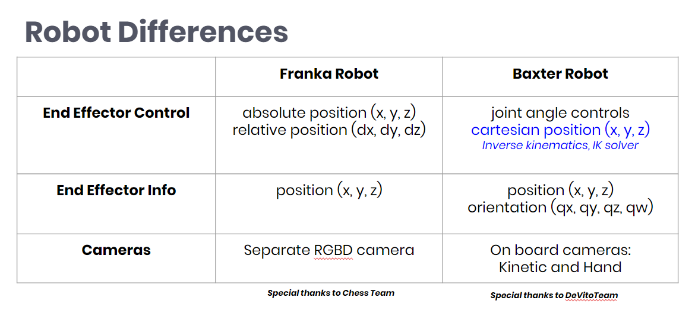
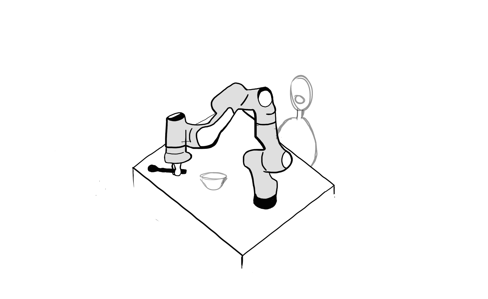

FRANKA |rarr| Baxter
====================

The team initially started off using FRANKA robot, however, due to control restraints, the team switched to controlling Baxter.

For the reader's interest, the main differences between FRANKA and BAXTER are described below.

Using Franka
============

Setting Up
^^^^^^^^^^

Visit https://de3-rob1-chess.readthedocs.io to see how franka was setted up.

This `site <https://frankaemika.github.io>`_ was used to install the live kernel, libfranka and franka_ros.

Connecting to FRANKA
^^^^^^^^^^^^^^^^^^^^

**Using Wifi:** The FRANKA connection should be automatically done.

**Using Ethernet Cable:** Create a wireless network using the IP address of the robot and IP address of the computer and use them to connect to the robot. After that you can connect to the web interface.

**Using the Web Interface:**

To connect to the web interface go to https://robot.franka.de.

Without using the lanline to connect FRANKA and the laptop, the web interface can be accessed through the IP address (https://192.168.0.88) to unlock the brakes before starting.

The login is:

* Username: ``robin``
* Password: ``deniro``

Connection between Franka and the computer terminal can be made done using Wifi or an ethernet cable.

Controlling Franka
^^^^^^^^^^^^^^^^^^

FRANKA can be controlled using the libfranka library, which is only accessible using the C++ language. Petar and Fabian have made some libfranka functions accessible by Python and the Chess team has made a Python library for FRANKA.

Credits
^^^^^^^
Chess team for providing and recording through documentation on basic Franka controls.
