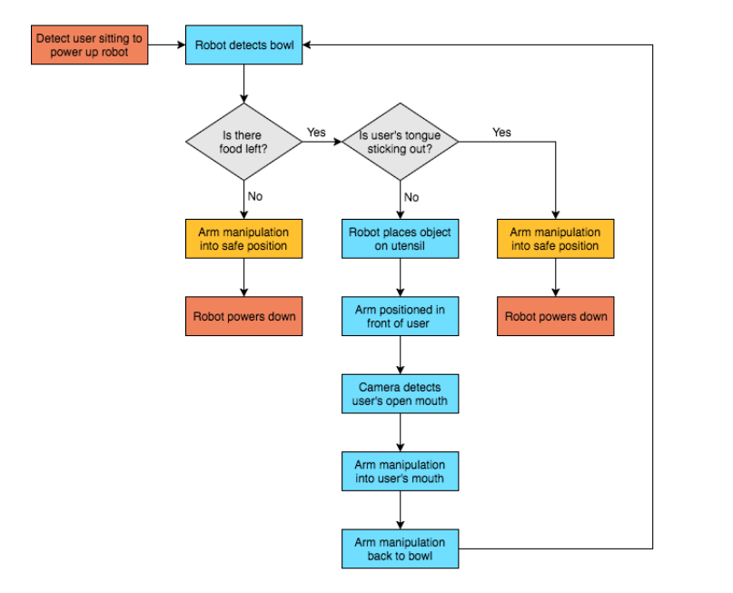

Project Plan
============

Problem definition
^^^^^^^^^^^^^^^^^^
The goal of this project is to program the FRANKA Emika robotic arm (nicknamed “Panda”) to prepare some breakfast and feed a person. The outcome of the project will be demonstrated by performing the whole scenario fully autonomously, including the perception of the person, the person’s mouth, etc.

Key User Needs
^^^^^^^^^^^^^^
- To feel safe
- To have control of when they are fed
- To be fed without moving their arms

Live Demo Scenario
^^^^^^^^^^^^^^^^^^
We want the live demo to show five key functions of the robot; detecting open/closed mouth, impedance control, arm manipulation, detect the user and mouth status, and put food on the utensil. Table 1 shows additional functions with lesser importance that can be added to the robot.

The team will focus on achieving the most important functions first and making sure that they are safe and work properly. Once completed the team will move on to implementing the less important functions of the robot depending on time restrictions.

Flowchart
^^^^^^^^^

List of Resources/ Equipment
^^^^^^^^^^^^^^^^^^^^^^^^^^^^
The team will have access to the FRANKA Emika (Panda) robot. This is a relatively new robot with little documentation available. In addition to this we will use a series of accessories, such as 2D laser scanning (LIDAR, Asus Xtion logitech c920) and RGB-D (Kinect) sensors to map the space and perform face and object recognition.

The software resources available are  OMPL/MoveIt, pcl library (to detect cereal box), OpenCV, ROS library and past work from past robotics tutorials and resources provided by lecturers. Other materials required will be food and eating utensils required for eating.

