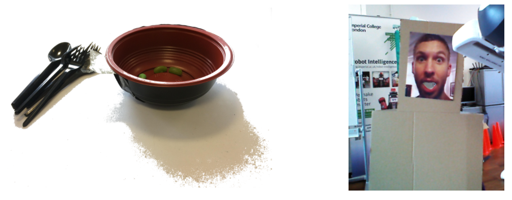
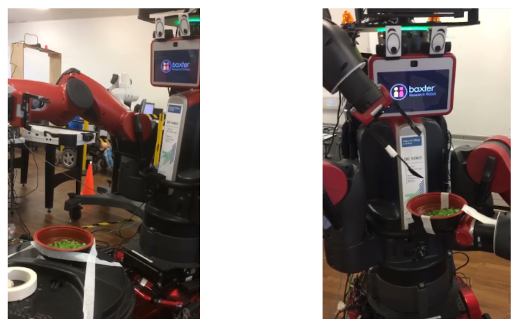

Scenerio
========

Plastic spoons and the bowl were stuck onto the grippers of the Baxter robot using tape. Many broke in the process of testing. Whenever the robot was disabled, the arm of the robot would go down causing the cutlery to snap. Cardboard faces were used for safety reasons during testing. Solid green candy were used for safety and food detection reasons. Liquid foods have high risk of damaging the robot.

Originally the bowl was stuck on to a separate surface as oppose to the hand of the robot. However, it was found that more calibration and detection work would need to be done so that the robot would be able to recognise the bowl and scoop from it. To fix the position of the bowl in reference to the robot, the bowl was attached to the robot’s left end effector so that the robot is guaranteed to be able to reach the food easily.

