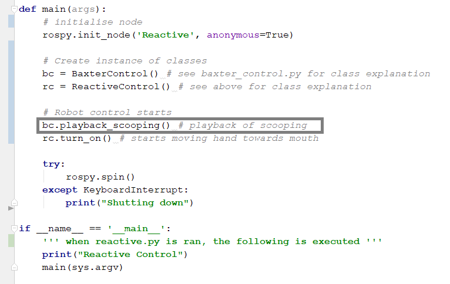
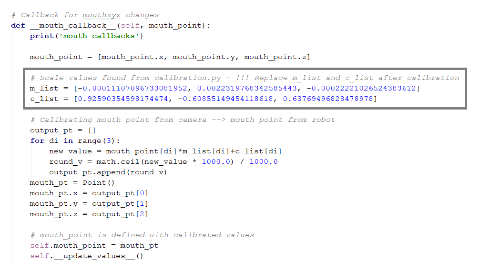

Step-By-Step
============

Food Detection Demo
^^^^^^^^^^^^^^^^^^^

This demo will program will view the spoon using the Baxter hand camera and detect whether or not their is food in the spoon. The figure below shows the outcome, viewing the food through Baxter hand camera.

Below is the step-by-step method to run the demo:

Open a terminal and split in two.
Execute the following in the terminal:

.. code-block:: python

    >> cd catkin_ws
    >> bash baxter.sh
    >> roslaunch openni2_launch openni2.launch

In the second terminal execute the following:

.. code-block:: python

    >> cd catkin_ws
    >> bash baxter.sh
    >> cd src/fred/src
    >> python cam_baxter.py

Baxter Moving to Mouth Demo
^^^^^^^^^^^^^^^^^^^^^^^^^^^

This demo will program Baxter to scoop food and to put it to the detected mouth position from the Kinect camera. To program the robot to grip candy as oppose to scoop candy, simply replace bc.playback_scooping() to bc.playback_gripping() in the main part of reactive.py.

The gray boxed line shows where the code can be changed so that Baxter is gripping candy as oppose to scooping candy.

Below is the step-by-step method to run the demo:

    1. Baxter must be calibrated beforehand.
    2. Input the scale values from calibration into the __mouth_callback__ function in reactive.py python file.

The grey box outlines where in the code the new scale values should be placed.

    3. Ensure that the Baxter robot is set up, turned on, and enabled as described in this link. The physical components should also be prepared and taped onto Baxter.
    4. Open the terminal in the Lab computers.
    5. Execute the following in the terminal:  ``cd catkin_ws``
    6. Split the terminal horizontally into five sections. This can be done by right clicking on the terminal. Each divided terminal section should now be in the catkin_ws directory.
    7. or each terminal section, execute the following: ``bash baxter.sh``
    8. Execute the following for each of the different section terminals:

- **Terminal 1 |** This is for launching the Kinect camera. Although streams of red text might popup, as long as yellow text indicating the camera has successfully been enabled is shown, the launching has been successful.

.. code-block:: python

    >> roslaunch openni2_launch openni2.launch

- **Terminal 2 |** This runs the python program that will activate detection code for the kinetic camera. Two windows showing what the camera views should come up. One is in grayscale and the other in colour. The grayscale should have a white dot on where the program detects as where the mouth is.

.. code-block:: python

    >> cd src/fred/src
    >> python cam_kinetic

- **Terminal 3 |** This runs the playback server so that playback can be done.

.. code-block:: python

    >> rosrun baxter_interface joint_trajectory_action_server.py --mode velocity

- **Terminal 4 |** This runs the baxter publisher which helps the BaxterControl class to receive information from Baxter.

.. code-block:: python

    >> cd src/fred/src
    >> python baxter_pub.py

- **Terminal 5 |** This runs the main program that uses the various data from the other running programs.

.. code-block:: python

    >> cd src/fred/src
    >> python reactive.py

