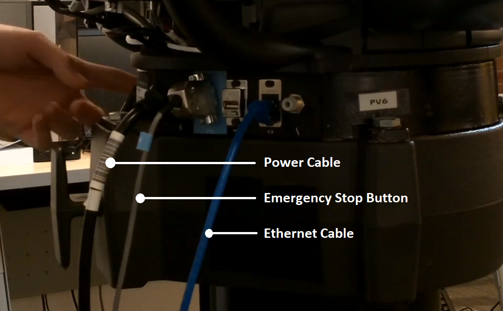

Using Baxter
============

Setting Up
^^^^^^^^^^
The Baxter Robot can be started using the provided lab computers. 
To connect to Baxter, ensure that your IP address is recorded in ''baxter.sh''.
Find you IP address using ``ifconfig`` in the terminal. 

.. code-block:: python

	#-----------------------------------------------------------------------------#
	#                 USER CONFIGURABLE ROS ENVIRONMENT VARIABLES                 #
	#-----------------------------------------------------------------------------#
	# Note: If ROS_MASTER_URI, ROS_IP, or ROS_HOSTNAME environment variables were
	# previously set (typically in your .bashrc or .bash_profile), those settings
	# will be overwritten by any variables set here.

	# Specify Baxter's hostname
	baxter_hostname="192.168.0.99"

	# Set *Either* your computers ip address or hostname. Please note if using
	# your_hostname that this must be resolvable to Baxter.
	your_ip="XXXXXXXXXXX"
	#your_hostname="my_computer.local"

	# Specify ROS distribution (e.g. indigo, hydro, etc.)
	ros_version="kinetic"
	#-----------------------------------------------------------------------------#

Turning Baxter on
^^^^^^^^^^^^^^^^^

First, ensure that Baxter is connected to the power cable, the emergency stop button, and the ethernet cable.

Make sure that the emergency stop button is disengaged and then press the turn on button on the robot, as the person in the image is doing.

Enable Robot
^^^^^^^^^^^^

If you would like to move the robot, run the following to enable the arms in the terminal:

.. code-block:: python

	$ rosrun baxter_tools enable_robot.py -e

To disable the arms and prevent overheating, or when it is not in use, replace  ``-e``  to  ``-d``.

Replace  ``-e``  to  ``-s`` for the status of the robot.

Running Baxter
^^^^^^^^^^^^^^

All codes are stored in the ''catkin_ws'' folder in the computer.
The executable files are in the ''src'' folder. The folders inside the ''src'' folder are packages.

To start Baxter, enter the correct directory and go into Baxter's terminal: 

.. code-block:: python

	$ cd ~/catkin_ws
	$ bash baxter.sh 

To run a python program:

.. code-block:: python

	$ rosrun {name_of_package} {python_filename}

Replace the content in the ``{ …}`` with the relevant text. 
To make an executable python file, each python file starts with:

.. code-block:: python

	#!/usr/bin/env python

Modules are also imported as shown below:

.. code-block:: python

	import rospy
	import rospkg
	import baxter_interface
	import baxter_external_devices
	from geometry_msgs.msg import (
	    PoseStamped,
	    Pose,
	    Point,
	    Quaternion,
	)
	from std_msgs.msg import (
	    Header,
	    Empty,
	)

Credits
^^^^^^^
Felix in the DeVito team for the crash course on how to use Baxter. 
